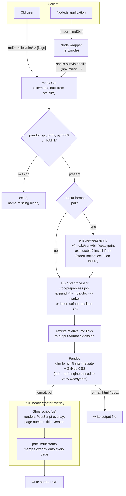

# Architecture

## Purpose and scope

This document describes how md2x is put together: its component boundaries, how it integrates external tools — `pandoc`, `gs`, `pdftk`, and `python3` on the operator's `PATH`, plus a WeasyPrint install md2x manages itself — into a single conversion pipeline, and the load-bearing design decisions behind that integration. It is the *how* layer; [`docs/md2x-spec.md`](./md2x-spec.md) is the *what* layer — the canonical statement of md2x's functional requirements and CLI/Node API surface — and this document does not restate it. Build, test, and contribution conventions live in [`AGENTS.md`](../AGENTS.md); file and directory layout lives in [`docs/project-structure.md`](./project-structure.md).

## Table of contents

1. [System overview](#system-overview)
2. [Tech stack](#tech-stack)
3. [Major components](#major-components)
4. [Key decisions](#key-decisions)
5. [Pointers](#pointers)

## System overview

md2x has two entry points that converge on one pipeline: the `md2x` CLI (built from `src/cli/*` into the single-file `bin/md2x`) and a thin Node.js wrapper (`src/node`) that shells out to that same built CLI via `shelljs` — the wrapper carries no independent conversion logic of its own.

<!-- For AI agents and non-visual readers, the diagram below is explained in detail in the paragraph that follows. -->

Every invocation, whichever entry point it starts from, performs the same sequence:

1. A **preflight check** confirms `pandoc`, `gs`, `pdftk`, and `python3` are on `PATH`, failing fast (exit `2`) and naming the first missing binary otherwise.
2. For PDF output only, an **automatic WeasyPrint bootstrap** (`ensure-weasyprint`) runs: a cheap executable check for `~/.md2x/venv/bin/weasyprint`, and, only on a cold environment where that check fails, creates the venv, bootstraps `pip`, and installs WeasyPrint into it — printing a one-time notice to stderr while it works and exiting `2` (naming the failed step) if the install fails. HTML and DOCX conversions skip this step entirely.
3. md2x's own **[TOC preprocessor](#toc-preprocessor)** (`toc-preprocess.py`) runs over the Markdown, expanding a `<!-- md2x:toc -->` marker (or inserting a TOC at a default position) into a nested list of `[Heading](#slug)` links as ordinary Markdown content — or leaving the document untouched when the resolved `--toc`/`--no-toc`/default-heuristic decision says no TOC is warranted.
4. Relative Markdown links between sibling documents (e.g. `./bar.md`) are **rewritten** to the output format's extension (e.g. `./bar.pdf`), so batch- and single-page-converted document sets remain cross-navigable after conversion.
5. **Pandoc** converts the (possibly TOC-expanded, possibly rewritten, possibly concatenated) Markdown to an HTML5 intermediate — used even when the final output is PDF — embedding the built-in GitHub-style CSS. For PDF output, `--pdf-engine` is pinned to the absolute path of the managed `~/.md2x/venv/bin/weasyprint` binary from step 2, rather than relying on whatever engine happens to be on `PATH`.
6. For `html`/`docx` output, that Pandoc-produced file is the final artifact. For `pdf` output, a second stage renders a PostScript header/footer overlay with **Ghostscript** and merges it onto every page of the Pandoc-generated PDF with **`pdftk multistamp`** before the final file is written.

**Error handling is fail-fast throughout.** The bash CLI runs under strict mode (`set -o errexit -o nounset -o pipefail`), so a failing `pandoc`, `gs`, or `pdftk` invocation aborts the whole conversion rather than producing a partial or silently-wrong output file. The Node wrapper surfaces CLI failures by throwing an `Error` that carries the subprocess's exit code and stderr. There is no retry or partial-recovery logic anywhere in the pipeline.

## Tech stack

- **Bash** (strict mode: `errexit`, `nounset`, `pipefail`) for the CLI, authored as modular source files under `src/cli/` and combined at build time into a single-file executable (`bin/md2x`) by `@liquid-labs/bash-rollup` — a build-time dependency only, not present at runtime.
- **Node.js** (ES modules) for the thin library wrapper under `src/node/`, built via `@liquid-labs/catalyst-scripts` into `dist/md2x.js`. [`shelljs`](https://www.npmjs.com/package/shelljs) is the one runtime npm dependency, used to invoke the built CLI as a subprocess.
- **Pandoc**, **Ghostscript** (`gs`), **pdftk**, and **`python3`** — external binaries, not libraries, integrated as runtime dependencies verified by the preflight `PATH` check. All four remain the operator's responsibility to install; md2x calls each as a subprocess and embeds no vendored copy of any of them.
- **WeasyPrint** — the one external dependency md2x manages itself, rather than requiring the operator to install it. It is Pandoc's HTML5-to-PDF rendering engine (invoked via `--pdf-engine`), not a tool md2x or its users ever call directly. On the first PDF conversion, md2x bootstraps a private virtual environment at `~/.md2x/venv` (see [WeasyPrint bootstrap](#weasyprint-bootstrap)) and pins Pandoc to the absolute path of the venv's `weasyprint` binary.
- **One piece of persistent local state.** `~/.md2x/venv` — the per-user WeasyPrint install described above — is a bootstrap artifact that survives across invocations, not document or user data. Aside from it, md2x remains a stateless, single-pass batch conversion tool operating directly on the filesystem.

## Major components

### CLI entry point and argument parsing

`src/cli/md2x.sh` (with `src/cli/lib/parameters.sh`) parses flags, resolves the input source list (files, directories searched recursively for `*.md`, or a lone `-` for stdin), runs the binary preflight check (`pandoc`, `gs`, `pdftk`, `python3`), and, for PDF output only, calls the [WeasyPrint bootstrap](#weasyprint-bootstrap) before dispatching — for each resolved document — to page generation. File discovery carries the search root each file was found under (the directory argument given on the command line, or the file's own directory when named directly) alongside the file path, so the entry point can derive each output file's placement under `--output-path` relative to that root — or, with `--flatten-dirs`, write directly into `--output-path` instead. It also owns the `--single-page` concatenation step, combining multiple input files into one intermediate Markdown file before conversion.

### WeasyPrint bootstrap

`src/cli/lib/ensure-weasyprint.sh` owns the one dependency md2x manages itself: WeasyPrint, the engine Pandoc uses to render PDF output. `src/cli/md2x.sh` calls its `ensure-weasyprint` function only when `--output-format` is `pdf`; HTML and DOCX conversions never trigger it. The warm-path check is a single, cheap `[[ -x "${HOME}/.md2x/venv/bin/weasyprint" ]]` test — no other filesystem work and no network access, on essentially every invocation. On the cold path (the test fails), it prints a one-time notice to stderr, then runs `python3 -m venv "${HOME}/.md2x/venv"`, bootstraps pip inside that venv (`python3 -m ensurepip --upgrade`), and installs a pinned version (`pip install weasyprint==69.0`) — with every byte of subprocess output from all three commands redirected to stderr, since stdout is a parsed data channel (`--list-files` file paths, `--to-stdout` document bytes) that bootstrap chatter would corrupt. A failure at any step names the failed step on stderr, removes the incomplete `~/.md2x/venv` so the next invocation retries from a clean state, prints a manual remediation command, and exits `2` — the same code the binary preflight check uses for "a required external dependency is not usable." There is no version or staleness check beyond the executable test; `rm -rf ~/.md2x/venv` is the documented way to force a clean reinstall. The venv is never activated and never prepended to `PATH` — Pandoc reaches WeasyPrint only via the absolute path `${HOME}/.md2x/venv/bin/weasyprint`, passed as `--pdf-engine`.

The cold path is guarded by a `mkdir`-based lock directory (`~/.md2x-venv.lock`, a sibling of `.md2x` rather than nested inside it) so two concurrent `md2x` processes hitting a cold start at once — e.g. the first-ever PDF conversion kicked off twice at once on a machine that has never run md2x before — cannot interleave their `venv`/`ensurepip`/`pip install` steps and corrupt the shared `~/.md2x/venv` directory. `mkdir` is atomic on POSIX filesystems, so exactly one concurrent invocation acquires the lock, with no external locking tool (e.g. `flock`, unreliable on macOS) required. The losing process blocks and waits for the winner — re-checking the executable test as it waits, since the winner may finish mid-wait — rather than failing fast, bounded by a timeout (180s) so a lock left behind by a process killed mid-bootstrap cannot deadlock every future invocation forever; a timed-out waiter prints an explicit manual remediation command, mirroring the failure-path message above, instead of hanging silently. The lock is released synchronously on every exit path out of `ensure-weasyprint()` (success and every failure) rather than via a script-level `EXIT` trap, since `src/cli/md2x.sh` registers its own `trap ... EXIT` later (for the CSS temp file) that would otherwise silently clobber one set here. The warm path is untouched by any of this — it remains the single `-x` test described above, with no lock directory ever created or removed.

### TOC preprocessor

`src/cli/lib/toc-preprocess.py` is a Markdown-in/Markdown-out stage that generates md2x's table of contents as literal Markdown content, rather than relying on Pandoc's native `--toc`. `generate-page()` (below) runs it ahead of the link-rewriting substitution, piping the document through it before handing the result to Pandoc. It scans the document for ATX and setext headings — skipping fenced/indented code blocks and multi-line HTML comments — and replicates Pandoc's `gfm_auto_identifiers` slug algorithm exactly, so a hand-written `[Heading](#slug)` link resolves to the same anchor Pandoc itself mints. It resolves the `<!-- md2x:toc -->` marker (or, absent a marker, inserts the TOC immediately after the document's title heading, or at the top of the document when there is none), and, when the CLI hands it `--mode auto` (neither `--toc` nor `--no-toc` given), applies a calibrated size heuristic — a TOC is added only when the document is estimated at more than about two rendered pages *and* has four or more top-level sections; an explicit marker overrides the heuristic and always forces the TOC on. `--toc`/`--no-toc` are resolved by `src/cli/md2x.sh` into a single `--mode on|off|auto` value before the script ever runs; the script never sees the CLI flags themselves, and both flags together is a fatal error the CLI rejects before any conversion work begins. Like `github.css` ([Bundled stylesheet](#bundled-stylesheet)), this is a source file rather than shell, and travels into the rolled-up `bin/md2x` via the same `bash-rollup` heredoc-inlining technique; `generate-page()` invokes the inlined source with `python3 -c`, letting the document itself occupy stdin rather than writing the script body out to a temp file.

### Page generation / conversion pipeline

`src/cli/lib/generate-page.sh` is the core of the system: it pipes the document through the [TOC preprocessor](#toc-preprocessor) and the link-rewriting substitution, materializing the result to a temp file, then builds and runs the Pandoc invocation against that file (embedding metadata and the bundled CSS; for PDF output, pinning `--pdf-engine` to the absolute path of the [managed WeasyPrint binary](#weasyprint-bootstrap) rather than relying on `PATH`), and — for PDF output — computes page dimensions from `pdftk ... dump_data`, renders the Ghostscript PostScript overlay, and merges it with `pdftk ... multistamp`. It also owns intermediate-artifact cleanup (the Pandoc log, the CSS temp file, the body-open/body-close temp files, and the TOC-preprocessed Markdown temp file, plus, for PDF, the overlay file) unless `--keep-intermediate` is given.

### Bundled stylesheet

`src/cli/lib/github.css` is embedded into the built CLI at build time — `bash-rollup` inlines its contents into a heredoc in `generate-page.sh` — so styling has no external file dependency at runtime; the CSS travels with the built CLI rather than being read from disk at conversion time. At conversion time, `generate-page()` writes that embedded content to a `mktemp`-created, `.css`-suffixed temporary file and passes that file's path to Pandoc's `--css`, rather than a process-substitution file descriptor, because WeasyPrint (the pinned `--pdf-engine`) MIME-sniffs `--css` from its path's file extension and cannot sniff a type from a process-substitution `/dev/fd/N` path. The temporary file is removed after the Pandoc invocation unless `--keep-intermediate` is given.

`github.css` scopes every rule under a bare `.markdown-body` class selector, but neither Pandoc's default html5 template nor a `-V`/`--variable` metadata hook places that class anywhere in the generated document. `generate-page()` works around this by writing two more temporary files — an opening `
` and a closing `
` — and passing them to Pandoc's `--include-before-body`/`--include-after-body` flags, which inject their content just inside the opening and closing `<body>` tags respectively. The result is a rendered body wrapped in a `markdown-body` div, satisfying `github.css`'s selectors exactly as well as a class on `<body>` itself would. Like the CSS temp file, both are removed after the Pandoc invocation unless `--keep-intermediate` is given.

### Node library wrapper

`src/node/index.js` and `src/node/md2x.js` translate the JS options object into CLI flags and shell out to the built CLI (`npx md2x ...`) via `shelljs`, returning the generated file paths (equivalent to `--list-files` output) or throwing an `Error` carrying the exit code and stderr on failure. It is a pass-through, not a parallel implementation: the CLI is the single source of truth for conversion behavior, and the wrapper cannot expose functionality the CLI doesn't already provide as a flag.

### Build pipeline

The `Makefile` drives two independent build outputs: `bash-rollup` combines `src/cli/md2x.sh` and its `src/cli/lib/*` dependencies into the single-file `bin/md2x`; `@liquid-labs/catalyst-scripts` compiles `src/node/*.js` into `dist/md2x.js`. Both outputs are gitignored and regenerated on build. Since the Node wrapper shells out to the built CLI, it is unusable straight from source without that build step having run first.

## Key decisions

- **HTML5 intermediate instead of a LaTeX engine, even for PDF output.** Pandoc renders every format — including PDF — through its HTML5 backend rather than `pdflatex`. Rationale: avoids requiring a LaTeX toolchain install. Trade-off: Pandoc's HTML5-to-PDF path has no native header/footer/page-number facility (addressed by the next decision), and its default HTML5-to-PDF engine — WeasyPrint, as of Pandoc 3.4 — becomes a de facto dependency of this choice; md2x closes that gap by managing WeasyPrint itself rather than leaving it as an undocumented requirement (see the dependency-set decision below).
- **PDF header/footer via a Ghostscript-rendered PostScript overlay merged with pdftk, rather than Pandoc-native headers.** Because PDF goes through the HTML5 path, `generate-page.sh` renders a standalone PostScript "overlay" document with `gs` — positioned using page dimensions read back from `pdftk ... dump_data` — and merges it onto every page of the Pandoc-generated PDF with `pdftk ... multistamp`. Rationale: this is the smallest addition that gets running headers, page-number footers, and an optional version string onto HTML5-rendered PDF output without switching rendering engines.
- **CLI-first; the Node library is a pass-through, not a parallel implementation.** `src/node` shells out to the already-built `bin/md2x` rather than reimplementing argument parsing or conversion in JavaScript. Rationale: a single source of truth for conversion behavior avoids two parsers/pipelines drifting apart. Trade-off: the Node library requires the CLI to be built first (see [Build pipeline](#build-pipeline)) and cannot expose behavior that doesn't correspond to a CLI flag — the spec's [Node library section](./md2x-spec.md#node-library) enumerates the resulting surface asymmetry.
- **Bash + `bash-rollup` for the CLI, rather than a single monolithic script or a Node-native CLI.** Rationale: keeps the shipped CLI dependency-free at runtime (bash plus the four operator-installed external binaries — no interpreter or `npm install` required to run `bin/md2x` standalone) while still allowing the source to be organized as separate, maintainable modules under `src/cli/lib/` during development.
- **md2x generates the table of contents itself, as Markdown content, rather than using Pandoc's `--toc`.** The [TOC preprocessor](#toc-preprocessor) expands `<!-- md2x:toc -->` (or a default insertion point) into a nested `[Heading](#slug)` bullet list before Pandoc ever sees the document. Rationale: Pandoc's native `--toc` produced two problems md2x had to work around rather than one consistent behavior — its `docx` writer never received a TOC at all (the docx `--toc` argument emits an unrendered Word field code the reader has to manually refresh), and its default html5 template placed the TOC's nav block *above* the document's own title heading rather than after it. Generating the TOC as ordinary Markdown content instead gives all three output formats one consistent, author-placed table of contents, and finally gives DOCX a working one. Trade-off: md2x now has to replicate Pandoc's `gfm_auto_identifiers` slug algorithm exactly, so a hand-written `[Heading](#slug)` link resolves to the anchor Pandoc itself mints, and that replication carries two documented divergences from real Pandoc — a heading containing an emoji character gets a TOC entry whose link does not resolve, and headings nested inside blockquotes or list items are not recognized by the scanner at all (correctly recognizing them would require full block-structure parsing, which the scanner deliberately does not implement).
- **Minimal, mature external dependency set — with one deliberate, self-managed exception.** `pandoc`, `gs` (Ghostscript), `pdftk`, and `python3` — each a long-established, actively-maintained tool — are operator-installed and preflight-verified: `pandoc`, `gs`, and `pdftk` cover Markdown conversion, PDF PostScript rendering, and PDF page manipulation respectively, instead of pulling in equivalent JavaScript libraries, and `python3` hosts the managed WeasyPrint install described below. The preflight check fails fast and names the missing binary rather than degrading silently. WeasyPrint is the sole exception: md2x installs and manages it itself, in an isolated `~/.md2x/venv` (see [WeasyPrint bootstrap](#weasyprint-bootstrap)), instead of adding it to the preflight list. Rationale for the asymmetry: WeasyPrint is a Pandoc *implementation detail* the user never invokes directly — Pandoc chose it as its own default HTML5-to-PDF engine starting with Pandoc 3.4 — so it was, before this change, an undocumented hidden requirement: every PDF conversion on Pandoc >= 3.4 failed outright with `'weasyprint' not found` until md2x closed the gap itself, rather than merely telling the operator to install a tool md2x never told them they needed. Self-managing it is not free, and the trade-offs are taken on deliberately: a `python3` runtime requirement (now preflight-checked on every invocation, not just PDF ones), first-run latency and a network dependency on the first PDF conversion, persistent per-user state (`~/.md2x/venv`) that previously did not exist, and an install path md2x itself must now keep working.
- **Test suite stubs the external-tool boundary rather than requiring the real toolchain.** Since md2x's own logic is argument construction, source-list resolution, and output-path derivation — it orchestrates `pandoc`/`gs`/`pdftk` as subprocesses and owns no rendering itself — the automated test suite (documented in [`AGENTS.md`](../AGENTS.md)) runs the CLI against stub `pandoc`/`gs`/`pdftk` executables on a test-controlled `PATH` for the bulk of its cases, rather than the real binaries. Trade-off: the stubbed suite cannot catch a real Pandoc/Ghostscript/pdftk regression or a malformed-but-accepted flag; a small, separately-tagged end-to-end set exercises the real toolchain for that fidelity and skips, rather than fails, when it is unavailable. The [TOC preprocessor's](#toc-preprocessor) slug algorithm is one case where that stub boundary genuinely cannot see far enough: whether a generated `#slug` actually matches the anchor real Pandoc mints is only assertable against real Pandoc, so `real-toolchain-e2e.bats` — not the stub suite — is what asserts the two identifier streams agree.

## Pointers

- [`docs/md2x-spec.md`](./md2x-spec.md) — the functional/requirements layer: use cases, behavioral requirements, and the CLI/Node API surface.
- [`AGENTS.md`](../AGENTS.md) — build, test, and contribution conventions for working on md2x.
- [`docs/project-structure.md`](./project-structure.md) — file and directory layout reference.
- [`README.md`](../README.md) — the project's front door and consumer-facing overview.
