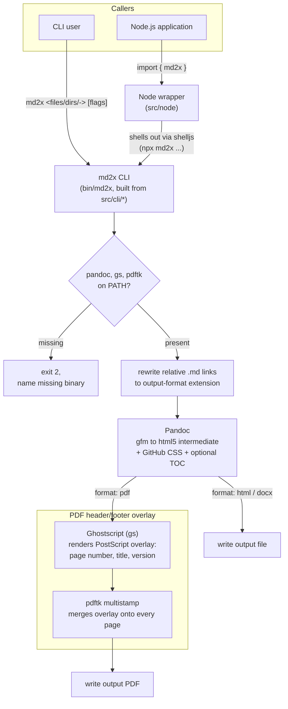

# Architecture

## Purpose and scope

This document describes how md2x is put together: its component boundaries, how it integrates the three external tools — Pandoc, Ghostscript, and pdftk — into a single conversion pipeline, and the load-bearing design decisions behind that integration. It is the *how* layer; [`docs/md2x-spec.md`](./md2x-spec.md) is the *what* layer — the canonical statement of md2x's functional requirements and CLI/Node API surface — and this document does not restate it. Build, test, and contribution conventions live in [`AGENTS.md`](../AGENTS.md); file and directory layout lives in [`docs/project-structure.md`](./project-structure.md).

## Table of contents

1. [System overview](#system-overview)
2. [Tech stack](#tech-stack)
3. [Major components](#major-components)
4. [Key decisions](#key-decisions)
5. [Pointers](#pointers)

## System overview

md2x has two entry points that converge on one pipeline: the `md2x` CLI (built from `src/cli/*` into the single-file `bin/md2x`) and a thin Node.js wrapper (`src/node`) that shells out to that same built CLI via `shelljs` — the wrapper carries no independent conversion logic of its own.

<!-- For AI agents and non-visual readers, the diagram below is explained in detail in the paragraph that follows. -->

Every invocation, whichever entry point it starts from, performs the same sequence:

1. A **preflight check** confirms `pandoc`, `gs`, and `pdftk` are on `PATH`, failing fast (exit `2`) and naming the first missing binary otherwise.
2. Relative Markdown links between sibling documents (e.g. `./bar.md`) are **rewritten** to the output format's extension (e.g. `./bar.pdf`), so batch- and single-page-converted document sets remain cross-navigable after conversion.
3. **Pandoc** converts the (possibly rewritten, possibly concatenated) Markdown to an HTML5 intermediate — used even when the final output is PDF — embedding the built-in GitHub-style CSS and, unless `--no-toc` is given, a table of contents.
4. For `html`/`docx` output, that Pandoc-produced file is the final artifact. For `pdf` output, a second stage renders a PostScript header/footer overlay with **Ghostscript** and merges it onto every page of the Pandoc-generated PDF with **`pdftk multistamp`** before the final file is written.

**Error handling is fail-fast throughout.** The bash CLI runs under strict mode (`set -o errexit -o nounset -o pipefail`), so a failing `pandoc`, `gs`, or `pdftk` invocation aborts the whole conversion rather than producing a partial or silently-wrong output file. The Node wrapper surfaces CLI failures by throwing an `Error` that carries the subprocess's exit code and stderr. There is no retry or partial-recovery logic anywhere in the pipeline.

## Tech stack

- **Bash** (strict mode: `errexit`, `nounset`, `pipefail`) for the CLI, authored as modular source files under `src/cli/` and combined at build time into a single-file executable (`bin/md2x`) by `@liquid-labs/bash-rollup` — a build-time dependency only, not present at runtime.
- **Node.js** (ES modules) for the thin library wrapper under `src/node/`, built via `@liquid-labs/catalyst-scripts` into `dist/md2x.js`. [`shelljs`](https://www.npmjs.com/package/shelljs) is the one runtime npm dependency, used to invoke the built CLI as a subprocess.
- **Pandoc**, **Ghostscript** (`gs`), and **pdftk** — external binaries, not libraries, integrated as runtime dependencies verified by the preflight `PATH` check. md2x calls each as a subprocess; it embeds no vendored copy of any of the three.
- No datastore. md2x is a stateless, single-pass batch conversion tool operating directly on the filesystem; it holds no state between invocations.

## Major components

### CLI entry point and argument parsing

`src/cli/md2x.sh` (with `src/cli/lib/parameters.sh`) parses flags, resolves the input source list (files, directories searched recursively for `*.md`, or a lone `-` for stdin), runs the binary preflight check, and — for each resolved document — dispatches to page generation. File discovery carries the search root each file was found under (the directory argument given on the command line, or the file's own directory when named directly) alongside the file path, so the entry point can derive each output file's placement under `--output-path` relative to that root — or, with `--flatten-dirs`, write directly into `--output-path` instead. It also owns the `--single-page` concatenation step, combining multiple input files into one intermediate Markdown file before conversion.

### Page generation / conversion pipeline

`src/cli/lib/generate-page.sh` is the core of the system: it builds and runs the Pandoc invocation (embedding metadata, the bundled CSS, and the TOC flag), applies the link-rewriting substitution to relative `.md` links, and — for PDF output — computes page dimensions from `pdftk ... dump_data`, renders the Ghostscript PostScript overlay, and merges it with `pdftk ... multistamp`. It also owns intermediate-artifact cleanup (the Pandoc log and, for PDF, the overlay file) unless `--keep-intermediate` is given.

### Bundled stylesheet

`src/cli/lib/github.css` is embedded inline into every Pandoc invocation via process substitution (`--css <(echo "$CSS")`), so styling has no external file dependency at runtime — the CSS travels with the built CLI rather than being read from disk at conversion time.

### Node library wrapper

`src/node/index.js` and `src/node/md2x.js` translate the JS options object into CLI flags and shell out to the built CLI (`npx md2x ...`) via `shelljs`, returning the generated file paths (equivalent to `--list-files` output) or throwing an `Error` carrying the exit code and stderr on failure. It is a pass-through, not a parallel implementation: the CLI is the single source of truth for conversion behavior, and the wrapper cannot expose functionality the CLI doesn't already provide as a flag.

### Build pipeline

The `Makefile` drives two independent build outputs: `bash-rollup` combines `src/cli/md2x.sh` and its `src/cli/lib/*` dependencies into the single-file `bin/md2x`; `@liquid-labs/catalyst-scripts` compiles `src/node/*.js` into `dist/md2x.js`. Both outputs are gitignored and regenerated on build. Since the Node wrapper shells out to the built CLI, it is unusable straight from source without that build step having run first.

## Key decisions

- **HTML5 intermediate instead of a LaTeX engine, even for PDF output.** Pandoc renders every format — including PDF — through its HTML5 backend rather than `pdflatex`. Rationale: avoids requiring a LaTeX toolchain install, shrinking the dependency footprint to three widely-available binaries. Trade-off: Pandoc's HTML5-to-PDF path has no native header/footer/page-number facility, which the next decision addresses separately.
- **PDF header/footer via a Ghostscript-rendered PostScript overlay merged with pdftk, rather than Pandoc-native headers.** Because PDF goes through the HTML5 path, `generate-page.sh` renders a standalone PostScript "overlay" document with `gs` — positioned using page dimensions read back from `pdftk ... dump_data` — and merges it onto every page of the Pandoc-generated PDF with `pdftk ... multistamp`. Rationale: this is the smallest addition that gets running headers, page-number footers, and an optional version string onto HTML5-rendered PDF output without switching rendering engines.
- **CLI-first; the Node library is a pass-through, not a parallel implementation.** `src/node` shells out to the already-built `bin/md2x` rather than reimplementing argument parsing or conversion in JavaScript. Rationale: a single source of truth for conversion behavior avoids two parsers/pipelines drifting apart. Trade-off: the Node library requires the CLI to be built first (see [Build pipeline](#build-pipeline)) and cannot expose behavior that doesn't correspond to a CLI flag — the spec's [Node library section](./md2x-spec.md#node-library) enumerates the resulting surface asymmetry.
- **Bash + `bash-rollup` for the CLI, rather than a single monolithic script or a Node-native CLI.** Rationale: keeps the shipped CLI dependency-free at runtime (bash plus the three external binaries — no interpreter or `npm install` required to run `bin/md2x` standalone) while still allowing the source to be organized as separate, maintainable modules under `src/cli/lib/` during development.
- **Minimal, mature external dependency set.** Three external binaries (`pandoc`, `gs`, `pdftk`) — each a long-established, actively-maintained tool — cover Markdown conversion, PDF PostScript rendering, and PDF page manipulation respectively, instead of pulling in equivalent JavaScript libraries. The preflight check fails fast and names the missing binary rather than degrading silently.
- **Test suite stubs the external-tool boundary rather than requiring the real toolchain.** Since md2x's own logic is argument construction, source-list resolution, and output-path derivation — it orchestrates `pandoc`/`gs`/`pdftk` as subprocesses and owns no rendering itself — the automated test suite (documented in [`AGENTS.md`](../AGENTS.md)) runs the CLI against stub `pandoc`/`gs`/`pdftk` executables on a test-controlled `PATH` for the bulk of its cases, rather than the real binaries. Trade-off: the stubbed suite cannot catch a real Pandoc/Ghostscript/pdftk regression or a malformed-but-accepted flag; a small, separately-tagged end-to-end set exercises the real toolchain for that fidelity and skips, rather than fails, when it is unavailable.

## Pointers

- [`docs/md2x-spec.md`](./md2x-spec.md) — the functional/requirements layer: use cases, behavioral requirements, and the CLI/Node API surface.
- [`AGENTS.md`](../AGENTS.md) — build, test, and contribution conventions for working on md2x.
- [`docs/project-structure.md`](./project-structure.md) — file and directory layout reference (planned).
- [`README.md`](../README.md) — the project's front door and consumer-facing overview.
