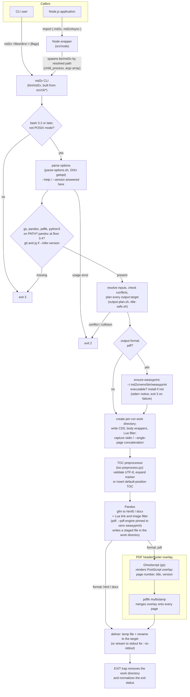

# Architecture

## Purpose and scope

This document describes how md2x is put together: its component boundaries, how it integrates external tools — `pandoc`, `gs`, `pdftk`, and `python3` on the operator's `PATH`, GNU `getopt`, `git` and `jq` for one optional flag, plus a WeasyPrint install md2x manages itself — into a single conversion pipeline, and the load-bearing design decisions behind that integration. It is the *how* layer; [`docs/md2x-spec.md`](./md2x-spec.md) is the *what* layer — the canonical statement of md2x's functional requirements and CLI/Node API surface — and this document does not restate it. Build, test, and contribution conventions live in [`AGENTS.md`](../AGENTS.md); file and directory layout lives in [`docs/project-structure.md`](./project-structure.md).

## Table of contents

1. [System overview](#system-overview)
2. [Tech stack](#tech-stack)
3. [Major components](#major-components)
4. [Key decisions](#key-decisions)
5. [Pointers](#pointers)

## System overview

md2x has two entry points that converge on one pipeline: the `md2x` CLI (built from `src/cli/*` into the single-file `bin/md2x`) and a thin Node.js wrapper (`src/node`) that spawns that same built CLI as a child process through `node:child_process`, with an argv array and no shell — the wrapper carries no independent conversion logic of its own.

<!-- For AI agents and non-visual readers, the diagram below is explained in detail in the paragraph that follows. -->

```mermaid
flowchart TD
    subgraph Callers
        CLIUser["CLI user"]
        NodeApp["Node.js application"]
    end

    CLIUser -->|"md2x &lt;files/dirs/-&gt; [flags]"| CLI
    NodeApp -->|"import { md2x, md2xAsync }"| NodeWrapper["Node wrapper<br/>(src/node)"]
    NodeWrapper -->|"spawns bin/md2x by resolved path<br/>(child_process, argv array)"| CLI

    CLI["md2x CLI<br/>(bin/md2x, built from src/cli/*)"] --> Guard{"bash 3.2 or later,<br/>not POSIX mode?"}
    Guard -- no --> Fail3["exit 3"]
    Guard -- yes --> Parse["parse options<br/>(parse-options.sh, GNU getopt)<br/>--help / --version answered here"]
    Parse -- "usage error" --> Fail2["exit 2"]
    Parse --> Preflight{"gs, pandoc, pdftk, python3<br/>on PATH? pandoc at floor 3.4?<br/>git and jq if --infer-version"}
    Preflight -- missing --> Fail3
    Preflight -- present --> Plan["resolve inputs, check conflicts,<br/>plan every output target<br/>(output-plan.sh, title-safe.sh)"]
    Plan -- "conflict / collision" --> Fail2
    Plan --> PdfCheck{"output format<br/>pdf?"}
    PdfCheck -- yes --> Bootstrap["ensure-weasyprint:<br/>~/.md2x/venv/bin/weasyprint<br/>executable? install if not<br/>(stderr notice; exit 3 on failure)"]
    PdfCheck -- no --> Work
    Bootstrap --> Work["create per-run work directory;<br/>write CSS, body wrappers, Lua filter;<br/>capture stdin / --single-page concatenation"]
    Work --> TocPreprocess["TOC preprocessor<br/>(toc-preprocess.py):<br/>validate UTF-8, expand marker<br/>or insert default-position TOC"]
    TocPreprocess --> Pandoc["Pandoc<br/>gfm to html5 / docx<br/>+ Lua link and image filter<br/>(pdf: --pdf-engine pinned to venv weasyprint)<br/>writes a staged file in the work directory"]

    Pandoc -->|"format: html / docx"| Deliver
    Pandoc -->|"format: pdf"| GS

    subgraph "PDF header/footer overlay"
        GS["Ghostscript (gs)<br/>renders PostScript overlay:<br/>page number, title, version"] --> PDFTK["pdftk multistamp<br/>merges overlay onto every page"]
    end
    PDFTK --> Deliver["deliver: temp file + rename to the target<br/>(or stream to stdout for --to-stdout)"]
    Deliver --> Done["EXIT trap removes the work directory<br/>and normalizes the exit status"]
```

Every invocation, whichever entry point it starts from, performs the same sequence:

1. An **interpreter guard** at the very top of `src/cli/md2x.sh` — written in POSIX `sh` syntax only, ahead of every strict-mode line and import — rejects a non-bash shell, bash older than 3.2, and bash in POSIX mode with exit `3`, so a wrong interpreter produces a clear message instead of a parse error.
2. **Option parsing** (`src/cli/lib/parse-options.sh`) resolves GNU `getopt`, tokenizes the command line against the project-owned flag table, and answers `--help` and `--version` (neither needs the preflight, and neither needs GNU `getopt`). Bad options are usage errors (exit `2`).
3. A **preflight check** confirms `gs`, `pandoc`, `pdftk`, and `python3` are on `PATH` and that `pandoc` is at or above the floor version (3.4), failing fast (exit `3`) on the first problem; `git` and `jq` are checked only when `--infer-version` is given.
4. **Input resolution and output planning.** Option conflicts are checked, files and directories are resolved into one deduplicated input list, and every output target is computed and checked for collisions, all before any conversion work (exit `2` on a violation). The `--title` rules are applied here too, so a doomed invocation never reaches the next step.
5. For PDF output only, an **automatic WeasyPrint bootstrap** (`ensure-weasyprint`) runs: a cheap executable check for `~/.md2x/venv/bin/weasyprint`, and, only on a cold environment where that check fails, creates the venv, bootstraps `pip`, and installs WeasyPrint into it — printing a one-time notice to stderr while it works and exiting `3` (naming the failed step) if the install fails. HTML and DOCX conversions skip this step entirely.
6. md2x creates the **per-run work directory** and registers the single `EXIT` trap that removes it. Every intermediate artifact lives there: the stylesheet files, the body-wrapper files, the Lua filter, captured stdin, the `--single-page` concatenation, the TOC-preprocessed Markdown, Pandoc's staged output, and, for PDF, the overlay and the stamped file.
7. md2x's own **[TOC preprocessor](#toc-preprocessor)** (`toc-preprocess.py`) runs over each Markdown source, rejecting invalid UTF-8 or NUL bytes, then expanding a `<!-- md2x:toc -->` marker (or inserting a TOC at a default position) into a nested list of `[Heading](#slug)` links as ordinary Markdown content — or leaving the document untouched when the resolved `--toc`/`--no-toc`/default-heuristic decision says no TOC is warranted.
8. **Pandoc** converts the (possibly TOC-expanded, possibly concatenated) Markdown to an HTML5 intermediate for HTML and PDF output (DOCX is written directly), applying the [link and image filter](#link-and-image-filter) that rewrites sibling-document links and resolves images. For PDF output, `--pdf-engine` is pinned to the absolute path of the managed `~/.md2x/venv/bin/weasyprint` binary from step 5, rather than relying on whatever engine happens to be on `PATH`. Pandoc writes to a staged file in the work directory, never to the destination.
9. For `html`/`docx` output, that staged file is the final artifact. For `pdf` output, a second stage renders a PostScript header/footer overlay with **Ghostscript** and merges it onto every page of the Pandoc-generated PDF with **`pdftk multistamp`**.
10. **Delivery.** The staged file is copied to a temporary file beside its target and renamed over the target (see [Output staging and delivery](#output-staging-and-delivery)); with `--to-stdout` it is streamed to stdout instead and nothing is written to disk.

**Error handling is fail-fast, with a fixed exit-code contract.** The bash CLI runs under strict mode (`set -o errexit -o nounset -o pipefail`), so a failing `pandoc`, `gs`, or `pdftk` invocation aborts the whole conversion rather than producing a partial or silently-wrong output file. Every failure is reported through the helpers in `src/cli/lib/errors.sh`, which print an `md2x: `-prefixed line on stderr and map the failure class to the exit code: `0` success, `1` runtime or conversion failure, `2` usage error, `3` missing or unusable dependency (the [spec](./md2x-spec.md#cli) lists what falls in each class). The one-line shape has two exceptions: `md2x-die-usage` adds an unprefixed `Try 'md2x --help'` line, and a WeasyPrint bootstrap failure prints several lines (the failed step, the subprocess output, and a manual remediation command). Two backstops in the run-wide `EXIT` trap keep the contract honest even when a failure slips past an explicit guard (see [Run cleanup and exit-status trap](#run-cleanup-and-exit-status-trap)). The Node wrapper surfaces CLI failures by throwing an `Error` that carries the subprocess's `exitCode` and `stderr`. There is no retry or partial-recovery logic anywhere in the pipeline.

## Tech stack

- **Bash 3.2 or later** (strict mode: `errexit`, `nounset`, `pipefail`) for the CLI, authored as modular source files under `src/cli/` and combined at build time into a single-file executable (`bin/md2x`) by `@liquid-labs/bash-rollup` — a build-time dependency only, not present at runtime. The 3.2 floor is the macOS system `/bin/bash`; every module avoids bash 4 features (no `${var,,}`, namerefs, or associative arrays) and expands arrays that may be empty with the `${ARR[@]+"${ARR[@]}"}` form, since bash before 4.4 treats an empty array as unset under `nounset`. No other build-time dependency contributes shell code: the `@liquid-labs/bash-toolkit` helpers it once used have been replaced by project-owned modules (see Key decisions).
- **Node.js** (>= 20, ES modules in source) for the thin library wrapper under `src/node/`, built by `bun build` into a dual ESM/CJS bundle (`dist/md2x.mjs`, `dist/md2x.cjs`) with a hand-written `dist/index.d.ts`, tested with `bun test` (linted with eslint). The wrapper has **no runtime npm dependencies**: it uses only `node:child_process`, `node:fs`, `node:path`, and `node:url`.
- **Pandoc** (at or above the floor version, 3.4), **Ghostscript** (`gs`), **pdftk**, and **`python3`** — external binaries, not libraries, integrated as runtime dependencies verified by the preflight `PATH` check. All four remain the operator's responsibility to install; md2x calls each as a subprocess and embeds no vendored copy of any of them.
- **GNU `getopt`** — required on macOS (Linux's util-linux provides it) and located by probing, never installed: `MD2X_GETOPT`, the Homebrew and MacPorts locations, then `PATH`. Homebrew itself is not required.
- **`git` and `jq`** — conditional runtime dependencies, needed only for `--infer-version` and checked lazily. **`perl` is not a dependency**: it once powered the link rewriter, which is now a Pandoc Lua filter.
- **WeasyPrint** — the one external dependency md2x manages itself, rather than requiring the operator to install it. It is Pandoc's HTML5-to-PDF rendering engine (invoked via `--pdf-engine`), not a tool md2x or its users ever call directly. On the first PDF conversion, md2x bootstraps a private virtual environment at `~/.md2x/venv` (see [WeasyPrint bootstrap](#weasyprint-bootstrap)) and pins Pandoc to the absolute path of the venv's `weasyprint` binary.
- **One piece of persistent local state.** `~/.md2x/venv` — the per-user WeasyPrint install described above — is a bootstrap artifact that survives across invocations, not document or user data. Aside from it, md2x remains a stateless, single-pass batch conversion tool operating directly on the filesystem; everything else it writes is the requested output or a per-run work directory deleted on exit.
- **CI.** `.github/workflows/ci.yml` runs `make qa` on `ubuntu-latest` and `macos-latest` and re-runs the CLI suite under the macOS system bash 3.2 (through the test harness's `MD2X_TEST_BASH` override). Each job has a `timeout-minutes` limit, and a `concurrency` group cancels superseded runs. The real-toolchain cases skip rather than fail when a tool cannot be installed on a runner.

## Major components

### CLI entry point and argument parsing

`src/cli/md2x.sh` is the entry point. It opens with the POSIX-`sh` interpreter guard (exit `3` under a non-bash shell, bash older than 3.2, or bash in POSIX mode, which is unsupported and untested), then enables strict mode, sources `src/cli/lib/index.sh`, and calls `md2x-parse-options` ([option parser](#option-parser)). It answers `--help` and `--version`, runs the binary preflight (`gs`, `pandoc`, `pdftk`, `python3`, then the pandoc floor, then `git` and `jq` only for `--infer-version`; see [Dependency preflight](#dependency-preflight)), validates option combinations, resolves the input source list (`md2x-process-input-args` and `md2x-resolve-inputs` in `src/cli/lib/input-discovery.sh`), plans every output target ([Output planning](#output-planning-and-collision-checks); with `--to-stdout` no output targets are planned), and, for PDF output only, calls the [WeasyPrint bootstrap](#weasyprint-bootstrap) before dispatching — for each resolved document — to page generation. Input resolution accepts files, directories searched recursively for `*.md` and `*.markdown` (case-insensitively; a relative root is searched as `./<root>` so a name such as `-x` or `!` is never read by `find` as an expression), or a lone `-` for stdin. File discovery carries the search root each file was found under (the directory argument given on the command line, or empty for a file named directly) alongside the file path, so planning can derive each output file's placement under `--output-path` relative to that root — or, with `--flatten-dirs`, write directly into `--output-path` instead. Stdin is copied byte for byte into the work directory (`cat`, not a `read` loop, so indentation, backslashes, and a missing final newline survive); zero bytes is a usage error. The entry point also owns the `--single-page` concatenation step, combining the resolved sources into one intermediate Markdown file, each preceded by a [source marker](#link-and-image-filter), before conversion.

The CLI is bundled into one file, so it carries three non-shell assets inlined as heredocs by `bash-rollup`: `github.css`, `toc-preprocess.py`, and `md2x-links.lua`. The Lua source is written with a plain heredoc rather than a `$(cat <<EOF ...)` substitution because bash 3.2 mis-parses quotes and parentheses inside a heredoc nested in a command substitution.

### Option parser

`src/cli/lib/parse-options.sh` replaced the bash-toolkit option parser. Its `MD2X_OPTION_TABLE` is the single source of truth for every flag — one `short|long|kind|VARIABLE` row each, with `-` for a flag that has no short form — and nothing derives a short flag from a variable name. The short-flag set is exactly `-D -F -h -o -p -s -t`. The parser still delegates tokenizing to GNU `getopt`, with its specification built from that table, which keeps long-option prefix abbreviation, `--opt=value`, options after positionals, and `--`; getopt's own error text is re-worded into an `md2x:` usage error rather than leaking through. `md2x-resolve-getopt` finds GNU `getopt` (a candidate is accepted only when `getopt --test` exits 4) without needing Homebrew: `MD2X_GETOPT` first (if set but not GNU, it fails rather than falling through), then the Homebrew Apple Silicon and Intel and MacPorts locations, then `getopt` on `PATH`, and last — only when `brew` is on `PATH` — the prefix `brew` reports. When no GNU `getopt` resolves, a small argv scan still answers `--help` and `--version` (skipping the value of a value-taking option, so `--title -h` is not a help request); anything else is exit `3` with install hints. `src/cli/lib/parameters.sh` now holds only the `OUTPUT_FORMATS` list. A bats drift test (`flag-table-drift.bats`) fails when the flag pairs in this table, in `md2x --help`, and in the README CLI reference table differ.

### Dependency preflight

`src/cli/lib/preflight.sh` holds the preflight helpers `md2x.sh` calls. `md2x-check-pandoc-version` parses `pandoc --version` and exits `3` below `MD2X_PANDOC_MIN_VERSION` (3.4), the release in which weasyprint became pandoc's default HTML-to-PDF engine; md2x supports only that engine. Only pandoc 3.10.1 has been exercised by hand. `md2x-require-infer-version-tools` checks `git` and `jq`, and only when `--infer-version` is given. The same file implements [version inference](#version-inference).

### Version inference

`--infer-version` is computed lazily: without the flag nothing touches `git`, `jq`, or `package.json`. With it, `md2x-infer-version` resolves the git work tree of the first input's directory (the current directory for stdin), reads `package.json` there with `jq`, and reports either its `version` or the literal `working` when `git status --porcelain` shows a dirty tree. A failure to find the work tree, the git directory, `package.json`, or a version, or a refusal, is one warning on stderr, and the footer omits the version; a failing `git status` is different: its status becomes `?`, so the footer prints `working` with no warning. Because the inputs' repository is untrusted (a `.git/config` can name a `core.fsmonitor`, a `filter.*.clean`, a `remote.*.uploadpack`, and so on, each of which can run a command), `git rev-parse --show-toplevel` runs first, through the hardened `md2x-infer-git`, to find the work tree. `md2x-infer-gitdir-refusal` then compares the git directory resolved from the input with the one resolved from the work-tree top and refuses a mismatch (a `core.worktree` redirect could otherwise point the work tree at a benign repository so the hostile config is never scanned). `md2x-infer-config-refusal` then reads the repository's local (and per-worktree) config *key names* — `git config --local --list --name-only -z`, also through `md2x-infer-git`, NUL-delimited so a key holding a tab or newline cannot be mistaken for two — and finds every one on a short allowlist of harmless keys; any other key, or a config that cannot be read, means the version is omitted without running `git status`. An empty `config.worktree` is accepted (no keys to scan). Only `git status` is gated by that key allowlist. Every `git` call goes through `md2x-infer-git`, which drops system and global config, disables hooks and fsmonitor, forbids every transport, disables lazy fetching, takes no optional locks, and ignores submodules and rename detection. The trade-offs of that hardening are listed in the spec's [Constraints and assumptions](./md2x-spec.md#constraints-and-assumptions).

### Error helpers

`src/cli/lib/errors.sh` owns user-facing failure output and the exit-code contract. `md2x-die-usage` (exit `2`, with a `Try 'md2x --help'` hint), `md2x-die-runtime` (exit `1`), and `md2x-die-dependency` (exit `3`) print one line to stderr prefixed `md2x: `, and `md2x-warn` prints `md2x: warning: `. Color is used only when stderr is a terminal and `NO_COLOR` is unset or empty; the helpers never call `tput` or fold lines. They replace the bash-toolkit `echoerrandexit`/`echofmt` helpers, which emitted unconditional ANSI color and folded text. Raw tool errors do not reach the user: `getopt` messages are re-worded, `command -v` replaces `type` in the preflight, and filesystem failures are checked first and reported as `md2x` errors.

### Title handling

`src/cli/lib/title-safe.sh` validates and encodes the `--title` for the three sinks it reaches, since the title is untrusted text. The **filename sink**: when `--title` determines an output file name (no `-o`, no `--to-stdout`), `md2x-validate-title` rejects, with exit `2`, a title that is empty, `.`, `..`, or contains `/` or a control character; with `-o` or `--to-stdout` the title is display-only and any printable text is accepted. The **metadata sink**: `--infer-title` passes the title as one argv element, `-M title=<text>`, which Pandoc keeps as a literal string (a metadata file would parse it as Markdown or YAML and apply smart quotes). The **PostScript sink**: `md2x-ps-string` strips control characters and backslash-escapes `\`, `(`, and `)` before the title (and the version string) is interpolated into the Ghostscript program, so quotes, parentheses, and non-ASCII text cannot corrupt the overlay (glyph coverage for non-Latin scripts depends on the overlay's built-in Helvetica font). The same file holds `md2x-title-display`, which shows any untrusted name in a message with control characters replaced by `?`, and `md2x-strip-markdown-ext`. The Node wrapper never derives a filesystem path from `title`.

### Output planning and collision checks

`src/cli/lib/output-plan.sh` holds the path helpers (`md2x-canonical-path`, `md2x-canonical-target`, `relative-output-dir`, `md2x-join-path`, `md2x-parent-dir`) and the checks `md2x.sh` runs while planning. Before any conversion — and before the WeasyPrint bootstrap can start — `md2x.sh` computes every output target from the resolved input list: the `-o` file, or the `--output-path` directory plus the mirrored relative directory (omitted with `--flatten-dirs`) plus `<title>.<format>`. Each target is checked (`md2x-check-output-location`: not an existing directory, and a creatable parent) and compared case-insensitively against every other target and against every input, so two inputs that map to one output, or an output that would overwrite its own input, are a usage error naming the sources and the target. Collision records are held as one shell variable per key (`md2x-plan-key-hex`, `md2x-record-set`, `md2x-record-get` in `output-plan.sh`), so a lookup takes constant time, since bash 3.2 has no associative arrays. `-o` and `--to-stdout` are accepted only when exactly one output results, and their conflicts with `-p` and `--list-files` are rejected in the same pre-conversion phase. `--output-path` has trailing slashes dropped and must not be an existing non-directory.

### Output staging and delivery

Pandoc never writes to the destination. It writes a fixed-name staged file (`output.<format>`) in the work directory: Pandoc picks its writer from the extension of its `-o` path, so a user-chosen `-o` name could not be handed to it directly, and a failed conversion can never leave a partial file at the destination. For PDF the overlay is stamped onto that staged file in place. `md2x-deliver-output` then delivers it without ever writing through the target path: the staged file is copied to a `mktemp` file in the target's own directory, given the umask-derived mode a plain new file would get, re-checked with `test -ef` against every input (which catches a hard link, symlink, or alternate path to an input that the plan-time string comparison cannot see), and renamed over the target with `mv`, which is atomic within one directory and replaces a symlink at the target rather than following it. A target that is a directory, or a symlink to one, is refused. The pending temp file is tracked in `MD2X_DELIVERY_TEMP` so the run-wide `EXIT` trap removes it if the run is interrupted between `mktemp` and `mv`. With `--to-stdout` the staged file is streamed to stdout and nothing else is written.

### WeasyPrint bootstrap

`src/cli/lib/ensure-weasyprint.sh` owns the one dependency md2x manages itself: WeasyPrint, the engine Pandoc uses to render PDF output. `src/cli/md2x.sh` calls its `ensure-weasyprint` function only when `--output-format` is `pdf`, and only after all option, input, and output-plan validation; HTML and DOCX conversions never trigger it. The warm-path check is a single, cheap `[[ -x "${HOME}/.md2x/venv/bin/weasyprint" ]]` test — no other filesystem work and no network access, on essentially every invocation. On the cold path (the test fails), it prints a one-time notice to stderr, then runs `python3 -m venv "${HOME}/.md2x/venv"`, bootstraps pip inside that venv (`python3 -m ensurepip --upgrade`), and installs a pinned version (`pip install weasyprint==69.0`) — with every byte of subprocess output from all three commands redirected to stderr, since stdout is a parsed data channel (`--list-files` file paths, `--to-stdout` document bytes) that bootstrap chatter would corrupt. A failure at any step names the failed step on stderr, removes the incomplete `~/.md2x/venv` so the next invocation retries from a clean state, prints a manual remediation command, and exits `3` — the same code the binary preflight check uses for "a required external dependency is not usable." There is no version or staleness check beyond the executable test; `rm -rf ~/.md2x/venv` is the documented way to force a clean reinstall. The venv is never activated and never prepended to `PATH` — Pandoc reaches WeasyPrint only via the absolute path `${HOME}/.md2x/venv/bin/weasyprint`, passed as `--pdf-engine`.

The cold path is guarded by a `mkdir`-based lock directory (`~/.md2x-venv.lock`, a sibling of `.md2x` rather than nested inside it) so two concurrent `md2x` processes hitting a cold start at once — e.g. the first-ever PDF conversion kicked off twice at once on a machine that has never run md2x before — cannot interleave their `venv`/`ensurepip`/`pip install` steps and corrupt the shared `~/.md2x/venv` directory. `mkdir` is atomic on POSIX filesystems, so exactly one concurrent invocation acquires the lock, with no external locking tool (e.g. `flock`, unreliable on macOS) required. The losing process blocks and waits for the winner — re-checking the executable test as it waits, since the winner may finish mid-wait — rather than failing fast, bounded by a timeout (180s) so a lock left behind by a process killed mid-bootstrap cannot deadlock every future invocation forever; a timed-out waiter prints an explicit manual remediation command, mirroring the failure-path message above, and exits `3` instead of hanging silently. The lock is released synchronously on every exit path out of `ensure-weasyprint()` (success and every failure) rather than via a script-level `EXIT` trap: the bootstrap runs before `src/cli/md2x.sh` registers its single run-wide `EXIT` trap (see [Run cleanup and exit-status trap](#run-cleanup-and-exit-status-trap)), and bash keeps only one handler per signal, so a trap set here would be silently clobbered by that later one. The warm path is untouched by any of this — it remains the single `-x` test described above, with no lock directory ever created or removed.

### TOC preprocessor

`src/cli/lib/toc-preprocess.py` is a Markdown-in/Markdown-out stage that generates md2x's table of contents as literal Markdown content, rather than relying on Pandoc's native `--toc`. `generate-page()` (below) pipes each document through it before handing the result to Pandoc, and it also rejects input that is not valid UTF-8 or contains NUL bytes (exit `1`, naming the file); `--single-page` runs it once per source in `--validate` mode so an encoding error names that source rather than the combined work-directory file. It scans the document for ATX and setext headings — skipping fenced/indented code blocks and multi-line HTML comments — and replicates Pandoc's `gfm_auto_identifiers` slug algorithm exactly, so a hand-written `[Heading](#slug)` link resolves to the same anchor Pandoc itself mints. It resolves the `<!-- md2x:toc -->` marker (or, absent a marker, inserts the TOC immediately after the document's title heading, or at the top of the document when there is none), and, when the CLI hands it `--mode auto` (neither `--toc` nor `--no-toc` given), applies a calibrated size heuristic — a TOC is added only when the document is estimated at more than about two rendered pages *and* has four or more top-level sections; an explicit marker overrides the heuristic and always forces the TOC on. `--toc`/`--no-toc` are resolved by `src/cli/md2x.sh` into a single `--mode on|off|auto` value before the script ever runs; the script never sees the CLI flags themselves, and both flags together is a fatal error the CLI rejects before any conversion work begins. Like `github.css` ([Bundled stylesheet](#bundled-stylesheet)), this is a source file rather than shell, and travels into the rolled-up `bin/md2x` via the same `bash-rollup` heredoc-inlining technique; `generate-page()` invokes the inlined source with `python3 -c`, letting the document itself occupy stdin rather than writing the script body out to a temp file.

### Page generation / conversion pipeline

`src/cli/lib/generate-page.sh` is the core of the system. For one document it pipes the source through the [TOC preprocessor](#toc-preprocessor), materializing the result to a work-directory file (a real file, not a process substitution: a process substitution's exit status is invisible to `errexit`, so a failing preprocessor would otherwise hand Pandoc a truncated document), then builds and runs the Pandoc invocation against that file: `--from gfm`, `--to html5` (or `docx`), the [stylesheet arguments](#bundled-stylesheet), the `
` wrapper includes (not for DOCX), `-M title=...` when `--infer-title` is given, the [Lua filter](#link-and-image-filter) and its `-M md2x-*` settings, and `-o` to the staged work-directory file. For PDF output it pins `--pdf-engine` to the absolute path of the [managed WeasyPrint binary](#weasyprint-bootstrap) rather than relying on `PATH`, then computes page dimensions from `pdftk ... dump_data`, renders the Ghostscript PostScript overlay (with the title and version [encoded for PostScript](#title-handling)), and merges it with `pdftk ... multistamp`. Finally it hands the staged file to [delivery](#output-staging-and-delivery).

Pandoc's stderr (which WeasyPrint inherits) is captured to a work-directory file and replayed afterwards through one exact-line filter that drops only the single `user-select: none` warning WeasyPrint reports on every PDF run because of Pandoc's own default template; every other line, including real errors, passes through unchanged, and the capture does not touch Pandoc's exit status. Pandoc's stdout is redirected away so `--to-stdout` and `--list-files` stay clean by construction.

Every intermediate artifact (the Pandoc log and captured stderr, the CSS and style files, the body-open/body-close files, the Lua filter, the TOC-preprocessed Markdown, captured stdin, the `--single-page` concatenation, the staged output, and, for PDF, the overlay and the pdftk output) lives under a fixed name in one per-run work directory that `md2x.sh` creates with `mktemp -d` (under `TMPDIR`, with a trailing-`X` template because BSD `mktemp` only randomizes trailing `X`s). No intermediate name is derived from `--title` or any other user input, and nothing but the requested outputs is ever written to the working or output directory. The directory is created only after option and input validation, so a usage error never creates it, and it is removed by the [run-wide `EXIT` trap](#run-cleanup-and-exit-status-trap) unless `--keep-intermediate` is given, in which case its path is printed once to stderr.

### Link and image filter

`src/cli/lib/md2x-links.lua` is a Pandoc Lua filter that replaces the earlier `perl` link converter. Because Pandoc has already parsed the document, links inside code spans and fenced code never reach it, and reference-style definitions arrive as ordinary links. It does two things. It rewrites a relative link ending in `.md` or `.markdown` to the output format's extension, keeping any fragment or query, and leaves absolute paths, URL-scheme links, and bare `#fragment` links alone. It also resolves each relative image against the directory of the source file that contains it: to an absolute path for PDF and DOCX (which embed it), or to a path relative to the output file's directory for HTML. A relative image whose file does not exist is recorded once per source and target in a work-directory miss file, which the shell side (`md2x-report-missing-images` in `src/cli/lib/link-filter.sh`) turns into one `md2x: warning: could not find image ...` line each, without changing the exit code.

The filter is inlined into `bin/md2x` like `github.css`, written to the work directory once per run, and passed with `--lua-filter`. Its settings reach it as pandoc metadata (`-M md2x-format`, `md2x-source-dir`, `md2x-source`, `md2x-out-dir`, `md2x-miss-file`, `md2x-nonce`), always supplied, with an empty value where unused. Pandoc gives a `-M` value precedence over a same-named key in a source's YAML front matter, so nothing a source document sets can supply or change a setting.

Under `--single-page`, the concatenation inserts a one-line marker comment, surrounded by blank lines, before each source's content: `<!-- md2x:source-dir=<ENC> source=<ENC> nonce=<NONCE> -->`, where the fields are percent-encoded so they cannot contain `-->`, spaces, or newlines (`md2x-percent-encode` and `md2x-source-marker` in `link-filter.sh`). The filter tracks the current source's directory from these `RawBlock`s in document order and strips them. The `<NONCE>` is a per-run random token (`md2x-new-nonce`, 128 bits read from `/dev/urandom`) that is also passed to the filter; the filter honors only a marker bearing it, so a comment that merely looks like a marker, such as one written in a source document, is ordinary content and cannot redirect image resolution or warning attribution. The filter uses only long-stable Pandoc Lua APIs (the `Pandoc` filter function, `pandoc.utils.stringify`, block `walk`, and the `Link`, `Image`, and `RawBlock` fields). Known limitations are listed in the spec: with `--flatten-dirs`, links across directories may not resolve; under `--single-page`, links between the combined files are not turned into internal anchors; and an unterminated code fence or raw HTML block in one source swallows the next source's marker.

### Bundled stylesheet

`src/cli/lib/github.css` is embedded into the built CLI at build time — `bash-rollup` inlines its contents into a heredoc in `md2x.sh` — so styling has no external file dependency at runtime; the CSS travels with the built CLI rather than being read from disk at conversion time. It was pruned of the rules WeasyPrint reports as `Ignored ...`, so a normal PDF run emits no WeasyPrint warnings of its own beyond the one filtered line described above. At the start of each run, `md2x.sh` writes the embedded content once to the work directory, and how a conversion uses it depends on the output format:

- **PDF** passes the fixed-name `github.css` work-directory file's path to Pandoc's `--css`, rather than a process-substitution file descriptor, because WeasyPrint (the pinned `--pdf-engine`) MIME-sniffs `--css` from its path's file extension and cannot sniff a type from a process-substitution `/dev/fd/N` path.
- **HTML** inlines the stylesheet: `md2x.sh` writes `style.html` (``) and Pandoc receives it through `--include-in-header`. A `--css` link would point at a work-directory file deleted at exit and leave every HTML file unstyled, so no HTML output references the work directory. (Images are not embedded, so HTML output is not self-contained.)
- **DOCX** receives no stylesheet.

`github.css` scopes every rule under a bare `.markdown-body` class selector, but neither Pandoc's default html5 template nor a `-V`/`--variable` metadata hook places that class anywhere in the generated document. `md2x.sh` works around this by writing two more files into the work directory — an opening `
` and a closing `
` — and passing them to Pandoc's `--include-before-body`/`--include-after-body` flags, which inject their content just inside the opening and closing `<body>` tags respectively (not used for DOCX). The result is a rendered body wrapped in a `markdown-body` div, satisfying `github.css`'s selectors exactly as well as a class on `<body>` itself would.

### Run cleanup and exit-status trap

`md2x.sh` registers exactly one `EXIT` trap, right after creating the work directory; bash keeps only one handler per signal, so any later cleanup need must be folded into it rather than registered separately. It removes the work directory (unless `--keep-intermediate`) and a pending `MD2X_DELIVERY_TEMP` delivery file, on every exit path — normal completion, `errexit`, and every `md2x-die-*`. It also normalizes the exit status, as two backstops that keep the 0/1/2/3 contract true whatever goes wrong:

- **Out-of-contract status.** Any status outside `0` to `3` becomes `1`, so a tool that slips past the explicit `|| md2x-die-runtime` guards under `errexit` (a stub or real tool exiting 64, say) cannot leak its own status as md2x's.
- **Completion sentinel.** bash 3.2 — but not 4.4 and later — has a quirk where a fatal `nounset` expansion error ends a non-interactive script with `$?` reading `0` inside the `EXIT` trap, so a trap that restores nothing would exit `0` for a failed run. Every success path reaches `MD2X_COMPLETED=true` at the very end of the script; a trap that sees status `0` without it knows the run was cut short, prints an error, and exits `1`.

Both backstops must be kept in any rewrite of the trap.

### Node library wrapper

`src/node/index.js` re-exports `src/node/md2x.js`, which provides `md2x()` (synchronous, via `spawnSync`) and `md2xAsync()` (a Promise, via `spawn`). Both validate the options object first — an unknown key, a wrong type, `markdown` together with `sources`, an empty `sources`, or a `-` in `sources` throws a `TypeError` (the async form rejects) before anything is spawned — then translate it into CLI flags and run the built CLI (`bin/md2x`, located by its resolved path relative to the package, never via npx/bunx or `PATH`; a missing bin is a clear error) as a child process with an **argv array and no shell**, so there is no quoting layer for a source name or title to escape. `--list-files` is always passed and the wrapper returns the generated file paths; `--` precedes the sources so a name like `-weird.md` is a file, not an option. A `markdown` string is fed to `md2x -` on stdin, so no staging file and no title-derived path exist. A non-zero exit throws an `Error` carrying `exitCode` and `stderr`; the CLI's stderr is forwarded to `console.error` unless `quiet` is set. It is a pass-through, not a parallel implementation: the CLI is the single source of truth for conversion behavior, and the wrapper cannot expose functionality the CLI doesn't already provide as a flag.

The package ships a **dual build**: `bun build` bundles the wrapper into `dist/md2x.mjs` (ESM) and `dist/md2x.cjs` (CJS), and the hand-written `src/node/index.d.ts` is copied unchanged to `dist/index.d.ts`. `package.json`'s `exports` map routes `import`, `require`, and `types` to those files (with `main` and `types` for older resolvers) and exposes `./package.json`. The wrapper locates its CLI from `import.meta.dirname`, falling back to `fileURLToPath(import.meta.url)`; since `bun build` would inline a bare `__dirname`, or the CJS `import.meta.url`, as a build-host absolute path, the Makefile's CJS build instead defines `import.meta.dirname` as the runtime `module.path` and `import.meta.url` as `undefined`. `make test-pack` (a release-time check, outside `make qa` because it runs `npm pack`, an install, and a TypeScript compile) packs the tarball, installs it into a temporary project, and proves native ESM import, CJS `require`, installed-`bin` resolution (against a stub, and that no bundle embeds the build path), and the types.

### Build pipeline

The `Makefile` drives independent build outputs: `bash-rollup` combines `src/cli/md2x.sh` and its `src/cli/lib/*` dependencies into the single-file `bin/md2x`, and `bun build` bundles `src/node/*.js` into the two Node bundles described above. The **version** is injected at build time: `md2x.sh` contains an `@MD2X_VERSION@` placeholder, and after the rollup the Makefile reads the `version` from `package.json` with `sed` (needing neither `jq` nor `node`), validates it, and substitutes it into `bin/md2x` as a literal, failing the build rather than embedding an empty or odd version. `package.json` is a prerequisite of `bin/md2x`, so a version bump rebuilds it, and `--version` reads nothing at run time. Dev tools resolve only to the lockfile-pinned `node_modules/.bin` binaries, never through `bunx`. All outputs are gitignored and regenerated on build. Since the Node wrapper spawns the built CLI, it is unusable straight from source without that build step having run first (`prepack` runs `make all`, so a published package always carries it).

## Key decisions

- **HTML5 intermediate instead of a LaTeX engine, even for PDF output.** Pandoc renders every format — including PDF — through its HTML5 backend rather than `pdflatex`. Rationale: avoids requiring a LaTeX toolchain install. Trade-off: Pandoc's HTML5-to-PDF path has no native header/footer/page-number facility (addressed by the next decision), and its default HTML5-to-PDF engine — WeasyPrint, as of Pandoc 3.4 — becomes a de facto dependency of this choice; md2x closes that gap by managing WeasyPrint itself rather than leaving it as an undocumented requirement (see the dependency-set decision below).
- **PDF header/footer via a Ghostscript-rendered PostScript overlay merged with pdftk, rather than Pandoc-native headers.** Because PDF goes through the HTML5 path, `generate-page.sh` renders a standalone PostScript "overlay" document with `gs` — positioned using page dimensions read back from `pdftk ... dump_data` — and merges it onto every page of the Pandoc-generated PDF with `pdftk ... multistamp`. Rationale: this is the smallest addition that gets running headers, page-number footers, and an optional version string onto HTML5-rendered PDF output without switching rendering engines. The header and footer are deliberately fixed (content, position, and font are not configurable): configurable headers and footers, a first-page header, and font choice are deferred, as are parallel conversion (`--jobs`) and progress output, because they are new feature surface rather than defects.
- **CLI-first; the Node library is a pass-through, not a parallel implementation.** `src/node` spawns the already-built `bin/md2x` rather than reimplementing argument parsing or conversion in JavaScript. Rationale: a single source of truth for conversion behavior avoids two parsers/pipelines drifting apart. Trade-off: the Node library requires the CLI to be built first (see [Build pipeline](#build-pipeline)) and cannot expose behavior that doesn't correspond to a CLI flag — the spec's [Node library section](./md2x-spec.md#node-library) enumerates the resulting surface asymmetry.
- **The Node wrapper uses `node:child_process` with argv arrays, not `shelljs`.** `md2x()` is `spawnSync` and `md2xAsync()` is `spawn`; no shell is involved. Rationale: this deletes the shell-quoting layer (where a title or file name could inject commands), the `shell: '/bin/bash'` requirement, and the package's only runtime dependency, rather than bumping `shelljs`. `markdown` travels on the child's stdin as `md2x -`, so the wrapper never stages a file, and never derives a path from `title`. Options are validated before anything spawns (a `TypeError`, or a rejection for `md2xAsync`); `sources: ['-']` is refused because the old behavior was to hang on stdin. Failures carry `exitCode` and `stderr`, and the stderr buffer limit is raised to 64 MiB so a chatty first-run WeasyPrint install cannot turn a success into a buffer error.
- **Dual ESM/CJS build with hand-written types and an `exports` map.** `bun build` runs twice (`.mjs` and `.cjs`, extensions chosen so each format is unambiguous whatever the package `type`), `index.d.ts` is hand-written and copied, and `exports` carries `import`/`require`/`types`. Rationale: a CJS consumer and a native-ESM consumer both get a working named import, and TypeScript users get types, without adding a transpiler or generator. The CLI is located through `import.meta.dirname`; `bun build` would otherwise bake a build-host absolute path into the bundle, which would break an installed package, so the CJS build defines `import.meta.dirname` as `module.path`. `make test-pack` is the guard: it installs the packed tarball and proves ESM, CJS, types, and bin resolution, and that no bundle embeds the build path. It is outside `make qa` because it needs `npm pack`, an install, and a TypeScript compile.
- **Bash + `bash-rollup` for the CLI, rather than a single monolithic script or a Node-native CLI.** Rationale: keeps the shipped CLI free of any interpreter or package-manager install beyond bash itself and the operator-installed external tools (so `bin/md2x` runs standalone), while still allowing the source to be organized as separate, maintainable modules under `src/cli/lib/` during development.
- **Bash 3.2 is the supported floor, enforced by a POSIX-`sh` guard.** Rationale: the macOS system `/bin/bash` is 3.2.57, most macOS users never install a newer one, and the Node wrapper's child resolves `env bash` against whatever `PATH` it is given. Requiring bash 4 would make the most common platform fail out of the box. Trade-off: every module stays free of bash 4 features and guards empty arrays under `nounset`, and the suite must be run under 3.2 to prove it (CI's macOS job does, through `MD2X_TEST_BASH=/bin/bash`). The guard sits at the very top of `md2x.sh`, ahead of the strict-mode lines and imports, in plain `sh` syntax, because bash and dash execute a script one complete top-level command at a time: it therefore runs, and reports a clear exit-`3` message (non-bash shell, bash older than 3.2, or bash in POSIX mode), before any later bash-only syntax can fail to parse.
- **The exit-code contract is `0`/`1`/`2`/`3`, and the `EXIT` trap enforces it.** `0` success, `1` runtime or conversion failure, `2` usage error, `3` missing or unusable dependency. Rationale: callers (the Node wrapper, scripts, CI) need to tell "fix your command line" from "fix your machine" from "the conversion failed"; the earlier alpha releases exited `2` for a missing dependency, which conflated the first two. The code is set in one place (`errors.sh`) and the trap normalizes anything out of range to `1` and turns a status-`0` exit without the completion sentinel into `1`, because under `errexit` a tool can slip past an explicit guard with its own status, and bash 3.2 can lose the status of a fatal `nounset` error entirely (see [Run cleanup and exit-status trap](#run-cleanup-and-exit-status-trap)). Trade-off: the trap is load-bearing and must be kept whole in any rewrite.
- **A project-owned error helper replaces the bash-toolkit echo helpers.** Rationale: `echoerrandexit`/`echofmt` emitted unconditional ANSI color, called `tput cols`, and folded lines, which garbles output in pipes, CI logs, and the Node wrapper's captured stderr. The `md2x:`-prefixed one-line messages are colored only on a terminal and honor `NO_COLOR`; raw `getopt`, `type`, `cat`, and `mkdir` errors are intercepted and re-worded so no tool's own text leaks.
- **A project-owned option parser over GNU `getopt`, driven by one explicit flag table, with brew-free discovery.** Rationale: the bash-toolkit parser derived a short flag from each variable name (producing undocumented `-q`, `-l`, `-n`, and `-i`, and a `-s` that did not match the docs), and located GNU `getopt` only through `brew` and `perl`. `MD2X_OPTION_TABLE` makes every short flag an explicit, reviewable choice (the set is `-D -F -h -o -p -s -t`; the rest are long-only) and is the file the drift test reads. GNU `getopt` stays as the tokenizer so unambiguous long-option prefixes, `--opt=value`, and interleaved options keep working, but it is found by probing known locations (`MD2X_GETOPT`, Homebrew, MacPorts, `PATH`, and `brew --prefix` only as a last resort) and accepted only when `--test` reports GNU, so Homebrew is optional. Help and `--version` work when no GNU `getopt` exists, through a small argv scan, so a user can always see how to fix the problem. Trade-off: getopt remains a macOS install for the user, and adding `--output` made `--out` ambiguous.
- **The flag table has one human-readable source: the README CLI reference.** The spec links to it rather than duplicating it, and a bats drift test fails when the `(short, long)` pairs in the parser table, `md2x --help`, and the README table differ. Rationale: three hand-maintained copies had already drifted.
- **One per-run work directory, one `EXIT` trap.** Rationale: every intermediate (stylesheet files, body wrappers, the Lua filter, captured stdin, the `--single-page` concatenation, the TOC-preprocessed Markdown, the Pandoc log and stderr, the staged output, the PDF overlay and stamped file) used to land in the working directory under names derived from `--title`, or in per-file temp files with their own cleanup, which made them overwrite user files, collide between runs, and leak on failure. Now a single `mktemp -d` directory with fixed, input-independent names holds all of them; nothing but the requested outputs reaches the working or output directory; and one trap (bash keeps only one handler per signal) removes it, plus the pending delivery temp file, on every exit path unless `--keep-intermediate` is given. Trade-off: the WeasyPrint bootstrap runs before the trap exists, so it releases its lock synchronously instead.
- **stdin is captured byte for byte into the work directory.** Rationale: the previous `while read` loop stripped indentation, ate backslashes, and dropped an unterminated last line. `cat` into `stdin.md` preserves the document exactly, and `generate-page` then always reads a file path. A zero-byte capture is a usage error; whitespace-only input is not empty.
- **The stylesheet is delivered per format.** PDF uses `--css` on the work-directory file (WeasyPrint reads it during the run and needs a `.css` path to sniff its type), HTML inlines the CSS as a `<style>` block through `--include-in-header`, and DOCX receives none. Rationale: a `--css` link in HTML output pointed at a file deleted at exit and left every HTML file unstyled. The CSS was also pruned of the rules WeasyPrint warns about, so a PDF run is quiet; the one remaining warning WeasyPrint emits because of Pandoc's default template is dropped by an exact-line filter on Pandoc's captured stderr (every other line, including real errors, is replayed unchanged and Pandoc's exit status is untouched). Trade-off: the filter matches one literal line, so a future WeasyPrint wording change shows the warning again, which fails safe.
- **`--title` is validated and encoded at each of its three sinks.** The filename sink rejects titles that are unusable as a file name (empty, `.`, `..`, containing `/` or a control character) with exit `2` — but only when the title actually names the file, since with `-o` or `--to-stdout` it is display-only. The metadata sink uses `pandoc -M title=<text>`, which Pandoc keeps literally; building a YAML or JSON metadata file would re-interpret the text as Markdown or YAML. The PostScript sink escapes `\`, `(`, `)` and strips control characters before the text enters the Ghostscript program, so a hostile or merely unusual title cannot terminate the string and inject PostScript or crash `gs`. Rationale: the title is attacker-reachable text flowing into a path, a metadata field, and an interpreted program, so encoding is part of each sink's contract rather than something each call site must remember. Trade-off: non-Latin glyph coverage depends on the overlay's built-in Helvetica.
- **Output is planned before any work, staged, and delivered by temp file and rename.** All targets are computed and checked (existing directories, creatable parents, case-insensitive collisions between outputs and against inputs, `-o`/`--to-stdout` needing exactly one output) before the WeasyPrint bootstrap can start, so a doomed invocation never pays for a network install or leaves partial output. Pandoc then writes only to a work-directory staged file, and delivery copies it to a temp file beside the target and `mv`s it into place, re-checking with `-ef` (device and inode) against the inputs immediately before the rename. Rationale: a failed conversion never leaves a half-written destination; a symlink or hard link at the target is replaced rather than written through, so an output can never silently overwrite an input's other names; and the plan-time string comparison alone cannot see hard links or alternate mount paths. Trade-off: a replaced target gets a new file with a umask-derived mode (the old mode and ownership are not kept), and output directories must not be writable by an untrusted party, since a parent swapped for a symlink during the run would redirect delivery.
- **Links and images are handled by a Pandoc Lua filter, not a `perl` converter.** The earlier `eval`-built `perl` regex rewrote `.md` link targets in raw text, so it could not tell a code span from a link, had no notion of fragments or reference definitions, and made `perl` a dependency. Pandoc has already parsed the document by the time a Lua filter runs, so code spans and fences are skipped correctly, fragments and reference-style links work, and images can be resolved per source file. Rationale for a filter over a second text pass: it cannot misparse what Pandoc has parsed. Trade-off: the filter relies on Pandoc's Lua API, which ties md2x to Pandoc's Lua support, and a missing image can only be reported by a side channel (a miss file the shell reads back) since the filter cannot write to the CLI's stderr itself.
- **`--single-page` source markers carry a per-run nonce, and every filter setting is passed as `-M`.** To resolve images per source, the concatenation inserts a marker comment before each source. A marker a source document could forge would let it redirect image resolution (and so read an arbitrary file into the output) or spoof warning attribution, so each marker carries a 128-bit token read from `/dev/urandom`, the filter honors only a marker bearing it, and md2x refuses to run if no random data is available rather than fall back to a guessable value. All settings, including the nonce, are always supplied as `-M` metadata (empty when unused), because Pandoc gives `-M` precedence over front matter, so a source's own YAML cannot supply or override any `md2x-*` key.
- **Version inference is lazy, config-allowlisted, and hardened.** The version is computed only for `--infer-version`, against the first input's git work tree (the cwd for stdin), so without the flag md2x never touches `git`, `jq`, or `package.json` and no stray `cat: package.json` noise appears. Rationale for the hardening: the work tree is input, and a `.git/config` can make git run commands (`core.fsmonitor`, `filter.*`, `remote.*.uploadpack`, `protocol.ext.allow`). md2x first finds the work tree and refuses a git directory that differs between the input and the work-tree top (a `core.worktree` redirect), then reads the config's NUL-delimited key names (the earlier `rev-parse` and `config` calls run through the same hardened `md2x-infer-git`) and gates `git status` only when every key is on a short allowlist of harmless ones (fail closed: an unreadable config, as with git older than 2.22, omits the version); the `git status` call itself drops system and global config, hooks, fsmonitor, transports, and lazy fetching, and ignores submodules and renames. Trade-off: dropping global config can yield a false `working` and a repository owned by another user is reported as not a work tree; the footer omits the version with one warning rather than fail the conversion. The spec lists these.
- **The version string is injected into `bin/md2x` at build time.** The Makefile replaces an `@MD2X_VERSION@` placeholder with the `package.json` version after the rollup, reading it with `sed` (no `jq` or `node` in the build), and fails the build on an empty or odd value. Rationale: `--version` is then a constant — no runtime read of `package.json`, which a global install does not reliably have next to the binary — and the build proves the placeholder was actually replaced. `package.json` is a prerequisite of the target, so a version bump rebuilds.
- **The pandoc floor is 3.4, checked in preflight.** Pandoc made weasyprint its default HTML-to-PDF engine in 3.4, and md2x supports only that engine, so 3.4 is the lowest version on which the default behaves as md2x expects; below it md2x exits `3` with the version found. Rationale: a stated, checked floor beats a silent runtime failure on an old distro package, and supporting a single engine keeps the PDF path simple. Trade-off: the floor follows from the Pandoc changelog rather than a test run on 3.4 itself; only pandoc 3.10.1 has been exercised by hand.
- **md2x generates the table of contents itself, as Markdown content, rather than using Pandoc's `--toc`.** The [TOC preprocessor](#toc-preprocessor) expands `<!-- md2x:toc -->` (or a default insertion point) into a nested `[Heading](#slug)` bullet list before Pandoc ever sees the document. Rationale: Pandoc's native `--toc` produced two problems md2x had to work around rather than one consistent behavior — its `docx` writer never received a TOC at all (the docx `--toc` argument emits an unrendered Word field code the reader has to manually refresh), and its default html5 template placed the TOC's nav block *above* the document's own title heading rather than after it. Generating the TOC as ordinary Markdown content instead gives all three output formats one consistent, author-placed table of contents, and finally gives DOCX a working one. Trade-off: md2x now has to replicate Pandoc's `gfm_auto_identifiers` slug algorithm exactly, so a hand-written `[Heading](#slug)` link resolves to the anchor Pandoc itself mints, and that replication carries two documented divergences from real Pandoc — a heading containing an emoji character gets a TOC entry whose link does not resolve, and headings nested inside blockquotes or list items are not recognized by the scanner at all (correctly recognizing them would require full block-structure parsing, which the scanner deliberately does not implement).
- **Minimal, mature external dependency set — with one deliberate, self-managed exception.** `pandoc`, `gs` (Ghostscript), `pdftk`, and `python3` — each a long-established, actively-maintained tool — are operator-installed and preflight-verified on every invocation: `pandoc`, `gs`, and `pdftk` cover Markdown conversion, PDF PostScript rendering, and PDF page manipulation respectively, instead of pulling in equivalent JavaScript libraries, and `python3` runs the TOC preprocessor and hosts the managed WeasyPrint install described below. GNU `getopt` is the one more required tool, found by probing rather than installed. `git` and `jq` are *conditional*: they are required, and checked lazily, only for `--infer-version`, so a user who never asks for a version needs neither. `perl` and `brew` are not dependencies (the link converter that needed `perl` is now the Lua filter, and `brew` is at most one last-resort probe for `getopt`). The preflight fails fast and names the missing binary (exit `3`) rather than degrading silently. WeasyPrint is the sole self-managed exception: md2x installs and manages it itself, in an isolated `~/.md2x/venv` (see [WeasyPrint bootstrap](#weasyprint-bootstrap)), instead of adding it to the preflight list. Rationale for the asymmetry: WeasyPrint is a Pandoc *implementation detail* the user never invokes directly — Pandoc chose it as its own default HTML5-to-PDF engine starting with Pandoc 3.4 — so it was, before this change, an undocumented hidden requirement: every PDF conversion on Pandoc >= 3.4 failed outright with `'weasyprint' not found` until md2x closed the gap itself, rather than merely telling the operator to install a tool md2x never told them they needed. Self-managing it is not free, and the trade-offs are taken on deliberately: a `python3` runtime requirement (preflight-checked on every invocation, not just PDF ones), first-run latency and a network dependency on the first PDF conversion, persistent per-user state (`~/.md2x/venv`) that previously did not exist, and an install path md2x itself must now keep working. Windows is unsupported and WSL is untested.
- **Test suite stubs the external-tool boundary rather than requiring the real toolchain.** Since md2x's own logic is argument construction, source-list resolution, and output-path derivation — it orchestrates `pandoc`/`gs`/`pdftk` as subprocesses and owns no rendering itself — the automated test suite (documented in [`AGENTS.md`](../AGENTS.md)) runs the CLI against stub `pandoc`/`gs`/`pdftk` executables on a test-controlled `PATH` for the bulk of its cases, rather than the real binaries. Trade-off: the stubbed suite cannot catch a real Pandoc/Ghostscript/pdftk regression or a malformed-but-accepted flag; a small, separately-tagged end-to-end set exercises the real toolchain for that fidelity and skips, rather than fails, when it is unavailable. The [TOC preprocessor's](#toc-preprocessor) slug algorithm is one case where that stub boundary genuinely cannot see far enough: whether a generated `#slug` actually matches the anchor real Pandoc mints is only assertable against real Pandoc, so `real-toolchain-e2e.bats` — not the stub suite — is what asserts the two identifier streams agree; likewise `links-and-images.bats` runs the Lua filter against real Pandoc.
- **CI runs `make qa` on Linux and macOS, plus a bash 3.2 pass.** Rationale: the two supported platforms differ exactly where md2x is fragile (bash version, `getopt` flavor, BSD versus GNU utilities), and the bash 3.2 floor is a claim that only run-time evidence supports. The workflow can only be proven green once it runs on GitHub, so a local `make qa` is the pre-push check.

## Pointers

- [`docs/md2x-spec.md`](./md2x-spec.md) — the functional/requirements layer: use cases, behavioral requirements, and the CLI/Node API surface.
- [`AGENTS.md`](../AGENTS.md) — build, test, and contribution conventions for working on md2x.
- [`docs/project-structure.md`](./project-structure.md) — file and directory layout reference.
- [`README.md`](../README.md) — the project's front door and consumer-facing overview.
